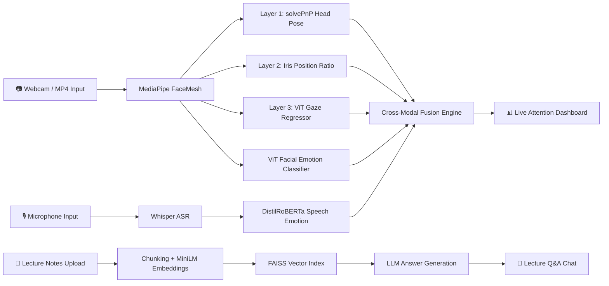

# Multi-Modal-Attention


<div align="center">

# 🎓 Classroom Intelligence Suite

### Real-time multi-modal attention monitoring for classroom environments

*Gaze tracking · Facial & speech emotion recognition · Cross-modal attention fusion · Lecture-aware RAG chatbot — all running on-device.*

[](https://www.python.org/)
[](https://streamlit.io/)
[](https://pytorch.org/)
[](LICENSE)

</div>

<!-- 
  🎥 HERO DEMO — replace with a short GIF of the app in action (record at ~10–15 fps, 720p is plenty)
  Save it at assets/demo.gif and this will render automatically.
-->
<div align="center">
  
  <p><i>↑ Replace this with your own demo.gif (sidebar → Live Monitoring → screen-record a short session)</i></p>
</div>

---

## 📑 Table of Contents

- [Overview](#-overview)
- [Demo](#-demo)
- [Features](#-features)
- [How It Works](#-how-it-works)
- [Tech Stack](#-tech-stack)
- [Project Structure](#-project-structure)
- [Getting Started](#-getting-started)
- [Configuration](#-configuration)
- [Usage Guide](#-usage-guide)
- [Screenshots](#-screenshots)
- [Limitations](#-limitations)
- [Roadmap](#-roadmap)
- [Contributing](#-contributing)
- [License](#-license)
- [Author](#-author)

---

## 🧭 Overview

Instructors rarely get real-time, objective feedback on whether their class is actually paying attention. Manual observation doesn't scale, and most existing engagement-tracking tools either need expensive hardware (eye trackers, dedicated rigs) or rely on slow, cloud-based post-session analysis.

**Classroom Intelligence Suite** is a self-contained Streamlit application that watches a webcam (or recorded video) and a microphone feed, and turns them into a live attention signal — entirely on-device, with no cloud dependency for the core monitoring pipeline. It fuses three independent signals — **gaze direction**, **facial emotion**, and **speech emotion** — into a single attentiveness score per student, rendered as a live dashboard. A built-in **Lecture Q&A chatbot** (RAG over uploaded lecture notes) rounds out the tool as a complete in-class teaching assistant.

---

## 🎥 Demo

<!-- 
  📹 VIDEO WALKTHROUGH — pick ONE of the options below and delete the other.

  OPTION A — Embed a GIF directly (simplest, autoplays on GitHub):
  

  OPTION B — Link to a hosted video (YouTube/Drive) via a clickable thumbnail:
  [](https://youtu.be/YOUR_VIDEO_ID)
-->

> 🔲 https://drive.google.com/file/d/1yhF-uMenprZV39LPQCGUXBiivZ35B86h/view?usp=drive_link

---

## ✨ Features

| | |
|---|---|
| 👁️ **Three-layer gaze cascade** | Falls back gracefully from geometric `solvePnP` head-pose → iris-position heuristics → a learned ViT gaze regressor |
| 😊 **Facial emotion recognition** | 7-class Vision Transformer classifier (happy, neutral, surprise, anger, etc.) |
| 🎙️ **On-device speech transcription** | OpenAI Whisper transcribes classroom audio in near real time, fully offline |
| 🗣️ **Speech emotion analysis** | DistilRoBERTa classifies the emotional tone of transcribed speech |
| 🔄 **Cross-modal attention fusion** | Combines gaze + facial emotion + speech emotion into one attentiveness score |
| 📊 **Live dashboard** | Real-time attention chart, per-face overlays, rolling transcript, and metric cards |
| 🤖 **Lecture-aware Q&A chatbot** | Upload lecture notes; ask questions answered via Retrieval-Augmented Generation |
| 🔒 **Privacy-first design** | Vision and audio inference run entirely on-device — no frames or audio leave the machine |
| 📝 **Session logging** | Attention scores and transcripts are saved to disk for post-session review |

---

## 🏗️ How It Works



The gaze cascade is the core design idea: a cheap geometric estimate (Layer 1) handles most frames; iris-position heuristics (Layer 2) kick in when geometry fails at steep angles; and an optional learned ViT regressor (Layer 3) only overrides a "front" prediction — never silently overriding the other two — to avoid spurious labels from an uncalibrated model.

---

## 🧰 Tech Stack

| Category | Technology |
|---|---|
| UI Framework | [Streamlit](https://streamlit.io/) |
| Computer Vision | [MediaPipe FaceMesh](https://google.github.io/mediapipe/), OpenCV |
| Gaze Estimation | OpenCV `solvePnP`, iris-ratio heuristics, ViT-B/16 (`timm`) |
| Facial Emotion | HuggingFace ViT (`trpakov/vit-face-expression`) |
| Speech-to-Text | [OpenAI Whisper](https://github.com/openai/whisper) (`whisper-tiny`) |
| Speech Emotion | DistilRoBERTa (`j-hartmann/emotion-english-distilroberta-base`) |
| RAG Embeddings | Sentence-Transformers (`all-MiniLM-L6-v2`) |
| Vector Search | [FAISS](https://github.com/facebookresearch/faiss) |
| LLM Generation | NVIDIA NIM (LLaMA-3.1-70B) — optional |
| Core Libraries | PyTorch, Transformers, NumPy, Pandas, Altair |

---

## 📁 Project Structure

```
classroom-intelligence-suite/
├── app.py                      # Main Streamlit application
├── requirements.txt            # Python dependencies
├── assets/                     # README images, GIFs, thumbnails
│   ├── demo.gif
│   └── screenshots/
├── checkpoints/                # (optional) ViT gaze regressor weights
├── logs/
│   ├── attention_log.csv       # Per-session attention scores
│   └── transcript_log.txt      # Per-session speech transcripts
└── README.md
```

---

## 🚀 Getting Started

### Prerequisites
- Python 3.10+
- A webcam and microphone (or a pre-recorded MP4 + audio file)
- (Optional) An NVIDIA NIM API key for LLM-generated answers in the Lecture Q&A tab

### Installation

```bash
# 1. Clone the repository
git clone https://github.com/amarjeetsingh92/classroom-intelligence-suite.git
cd classroom-intelligence-suite

# 2. Create and activate a virtual environment
python -m venv venv
source venv/bin/activate        # On Windows: venv\Scripts\activate

# 3. Install dependencies
pip install -r requirements.txt

# 4. Run the app
streamlit run app.py
```

The app will open at `http://localhost:8501`.

---

## ⚙️ Configuration

All configuration happens through the sidebar at runtime — no `.env` file required:

| Setting | Description |
|---|---|
| **Video Source** | Webcam or uploaded MP4 |
| **Gaze Model Backbone** | Choose ViT backbone; optionally upload a fine-tuned checkpoint |
| **Facial Emotion Model** | Any HuggingFace image-classification model (default: `trpakov/vit-face-expression`) |
| **Microphone Device** | Select input device for live audio capture |
| **NVIDIA NIM API Key** | *Optional* — without it, the Lecture Q&A tab returns raw retrieved passages instead of an LLM-generated answer |

---

## 📖 Usage Guide

1. **Live Monitoring tab** — select your video source, set class/subject names, and click **Start Monitoring**. The dashboard shows live gaze + emotion overlays, a rolling attention chart, and the latest speech transcript.
2. **Lecture Q&A tab** — upload lecture notes (`.txt` / `.pdf`), then ask questions in natural language. Answers are grounded in the uploaded material via retrieval-augmented generation.
3. **Session logs** — attention scores and transcripts are saved automatically to `logs/` for later review.

---

## 🖼️ Screenshots

<!-- 
  Drop your screenshots into assets/screenshots/ using these filenames,
  or update the paths below to match your own filenames.
-->

| Live Monitoring Dashboard | Gaze & Emotion Overlay |
|:---:|:---:|
|  |  |
| *🔲 Add screenshot* | *🔲 Add screenshot* |

| Live Attention Chart | Lecture Q&A Chat |
|:---:|:---:|
|  |  |
| *🔲 Add screenshot* | *🔲 Add screenshot* |

---

## ⚠️ Limitations

- Designed for a single fixed camera; not yet optimized for large, multi-camera lecture halls
- Speech emotion updates lag live audio by ~10–20 seconds (Whisper chunked transcription)
- Cross-modal fusion weights are heuristic and not yet calibrated against labelled engagement data
- No face-identity tracking across frames yet — per-student history isn't continuous

---

## 🛣️ Roadmap

- [ ] Quantitative evaluation against a labelled engagement dataset
- [ ] Temporal smoothing for facial emotion predictions
- [ ] Local LLM fallback (Ollama / llama.cpp) for fully offline Lecture Q&A
- [ ] Lightweight face-identity tracking across frames
- [ ] Streaming ASR to cut audio latency from ~10s to ~2–3s

---

## 🤝 Contributing

Contributions, issues, and feature requests are welcome. Feel free to open an issue or submit a pull request.

```bash
# Fork, then:
git checkout -b feature/your-feature
git commit -m "Add your feature"
git push origin feature/your-feature
# Open a Pull Request
```

---

## 📄 License

This project is licensed under the [MIT License](LICENSE).

---

## 👤 Author

**Amarjeet Kumar**
M.Sc. Computer Science, NIT Tiruchirappalli

[](https://github.com/amarjeetsingh92)

<div align="center">
<sub>⭐ If you found this project useful, consider starring the repo.</sub>
</div>
